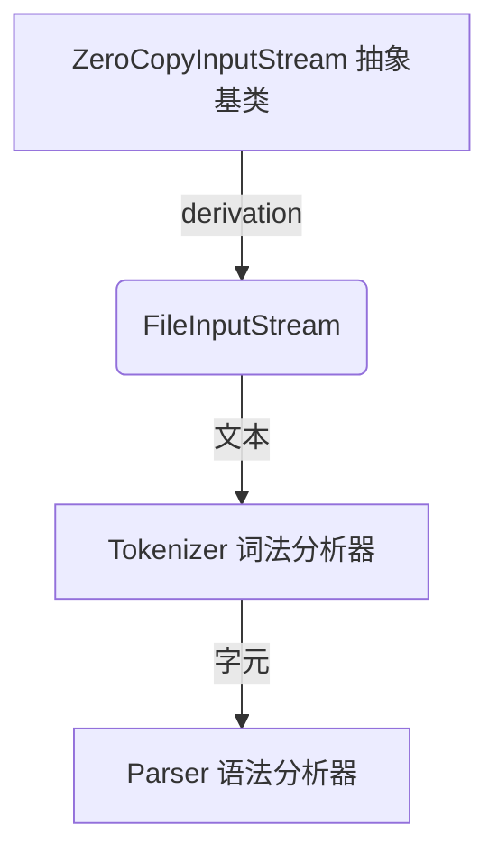

# 059 - 现实的 C++程序如何做文件 IO

Google [[ProtoBuf]]是一种高效的[[网络传输格式]]，它用一种协议描述语言来定义消息格式，并且自动生成[[序列化]]代码。Protobuf Compiler是这种“协议描述语言”的编译器，它读入协议文件.proto，编译生成C++、Java、Python代码。proto文件是个文本文件，然而Protobuf Compiler并没有使用ifstream来读取它，而是使用了自己的FileInputStream来读取文件。

[[参考]]